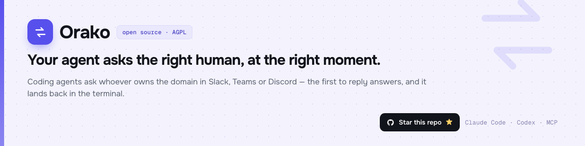

<p align="center">
  
</p>

# Orako

Orako lets AI agents ask the right teammate for missing context, wait for the
answer, and turn that answer into searchable team history.

It exposes a vendor-neutral remote MCP server for Claude Code, Codex, Cursor,
Gemini CLI, and other MCP clients. Humans answer from the web dashboard or a
connected messaging provider.

## What it provides

- Durable agent-to-human conversations with follow-ups and resolution.
- Searchable, organization-scoped decision history.
- Routing by project, expertise, availability, and source ownership.
- Dashboard, Slack, Discord, Telegram, and Microsoft Teams adapters.
- Local, OIDC, and development authentication modes.
- A single Go server with an embedded React dashboard.
- Stock PostgreSQL search using full-text search and `pg_trgm`.

## Editions

| Edition | Limits |
|---|---|
| Community | 5 members, 1 organization, 1 project |
| Licensed self-host | Limits encoded in a signed license |

The public repository contains the complete self-hosted application. Orako's
hosted billing and analytics implementation lives in a separate private
repository and is not required to run Core.

## Quick start

Requirements: Docker with Compose.

```sh
git clone https://github.com/orako-io/core.git
cd core
./scripts/bootstrap.sh
docker compose up -d --build
```

Open `http://localhost:8080` and sign in with the admin credentials generated in
`.env`.

For production setup, TLS, backups, SMTP, object storage, and upgrades, see
[Self-hosting](docs/SELF_HOSTING.md) and [Operations](docs/operations.md).

## Documentation

| Guide | GitHub source | Web |
|---|---|---|
| Self-hosting | [docs/SELF_HOSTING.md](docs/SELF_HOSTING.md) | [orako.io/docs/self-hosting](https://orako.io/docs/self-hosting) |
| Connect an agent | [docs/CONNECT_AGENTS.md](docs/CONNECT_AGENTS.md) | [orako.io/docs/connect-agents](https://orako.io/docs/connect-agents) |
| Messaging integrations | [docs/INTEGRATIONS.md](docs/INTEGRATIONS.md) | [orako.io/docs/integrations](https://orako.io/docs/integrations) |
| Operations | [docs/operations.md](docs/operations.md) | [orako.io/docs/operations](https://orako.io/docs/operations) |
| Backup and restore | [docs/BACKUP_RESTORE.md](docs/BACKUP_RESTORE.md) | [orako.io/docs/backup-restore](https://orako.io/docs/backup-restore) |

The Markdown files in `docs/` are canonical. The website publishes them during
its build so the repository and web documentation stay aligned.

## Development

Requirements: Go 1.25+, Node.js 20+, Docker, and
[Task](https://taskfile.dev).

```sh
cp .env.example .env
task up
```

Useful commands:

```sh
task test       # Go tests with the race detector
task lint       # golangci-lint
task build      # production binary
task proto      # regenerate protobuf bindings
task sqlc       # regenerate database bindings

cd web
npm ci
npm run build
```

Integration tests skip when PostgreSQL is unavailable. Set
`ORAKO_INTEGRATION=1` to require the database-backed suite.

## Architecture

Core follows ports-and-adapters boundaries:

- `internal/application` contains domain behavior and use cases.
- `internal/adapters` implements persistence and external providers.
- `internal/infra` exposes HTTP, Connect-RPC, MCP, and the embedded dashboard.
- `cmd/orako-server` composes the application.
- `proto` and `gen` define the public `orako.v1` contract.

The private hosted edition is compiled by an external overlay through narrow
composition seams. Core does not import the private repository.

## Security

Please do not open public issues for vulnerabilities. Follow
[SECURITY.md](SECURITY.md) to report them privately.

## Contributing

Read [CONTRIBUTING.md](CONTRIBUTING.md), [CLA.md](CLA.md), and
[CODE_OF_CONDUCT.md](CODE_OF_CONDUCT.md) before opening a pull request.

## License

Orako Core is licensed under
[GNU AGPL v3.0 or later](LICENSE). Protocol and reusable SDK files listed in
[LICENSING.md](LICENSING.md) are Apache-2.0.
